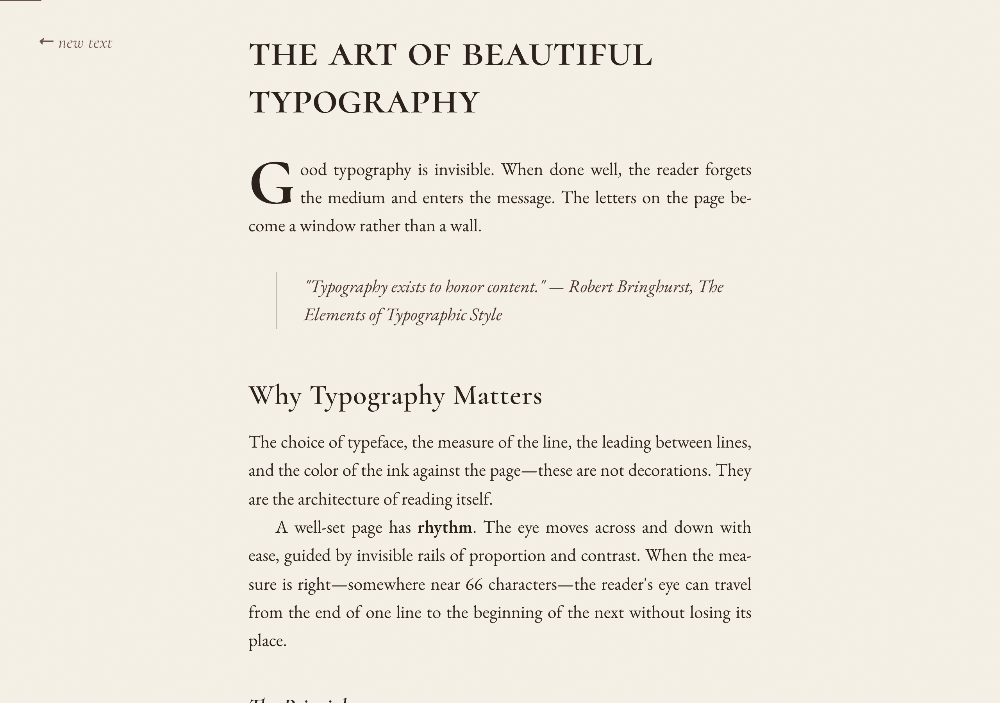

# Swankdown

**Read markdown beautifully.** Bringhurst-inspired typography for the digital age.



Swankdown renders markdown with the care and craft of fine book typography — drop caps, justified text, smart quotes, ornamental rules, and a curated palette of serif typefaces. Informed by Robert Bringhurst's [*The Elements of Typographic Style*](https://www.amazon.com/Elements-Typographic-Style-Robert-Bringhurst/dp/0881792128).

---

## Packages

| Package | Description | Status |
|---------|-------------|--------|
| [`web/`](/web) | Paste-and-read web app at [swankdown.gustavosaiani.com](https://swankdown.gustavosaiani.com) | Live |
| [`vscode/`](/vscode) | VS Code / Cursor extension — `Cmd+Shift+V` for Swankdown preview | Pre-release |
| [`cli/`](/cli) | CLI tool — `swankdown README.md` opens it styled in your browser | Pre-release |

---

## Typography

Swankdown's typographic system is built on a **1.25 major-third scale** with these principles:

- **Typefaces**: EB Garamond for body text, Cormorant SC & Cormorant Garamond for headings
- **Measure**: ~66 characters per line (28em) — the sweet spot for comfortable reading
- **Leading**: 1.58 line-height for body, tighter for headings
- **Paragraphs**: Indented continuation (no space between), justified with auto-hyphenation
- **Drop cap**: First paragraph opens with a large Cormorant SC initial
- **Smart typography**: Curly quotes, em/en dashes, ellipses, and multiplication signs — automatically

| Element | Treatment |
|---------|-----------|
| `h1` | Cormorant SC, small caps, large |
| `h2` | Cormorant Garamond, medium |
| `h3` | Cormorant Garamond, italic |
| Blockquotes | Italic, left-bordered, indented |
| Horizontal rules | Ornamental: `* · * · *` |
| Code blocks | Dark background, monospace |
| Tables | Small-cap headers, tabular numerals |

---

## Quick Start

### Web

Visit [swankdown.gustavosaiani.com](https://swankdown.gustavosaiani.com), paste your markdown, and click **Read**.

### CLI

```bash
cd cli && npm link
swankdown README.md
```

Supports `--watch` for live reload and stdin piping:

```bash
cat notes.md | swankdown
swankdown --watch draft.md
```

### VS Code / Cursor

```bash
cd vscode && code --install-extension .
```

Open any `.md` file and press `Cmd+Shift+V` for the Swankdown preview.

---

## Color Palette

| Token | Hex | Use |
|-------|-----|-----|
| `--paper` | `#f5f0e6` | Background |
| `--ink` | `#2a1f1a` | Body text |
| `--ink-light` | `#4a3530` | Secondary text |
| `--ink-faint` | `#6e534a` | Tertiary text |
| `--ink-ghost` | `#9a857a` | Subtle UI |
| `--accent` | `#6b2a2a` | Links (burgundy) |
| `--rule` | `#c9bfb0` | Dividers |

---

## License

MIT

---

*Set in EB Garamond & Cormorant · Typeset by Swankdown*
